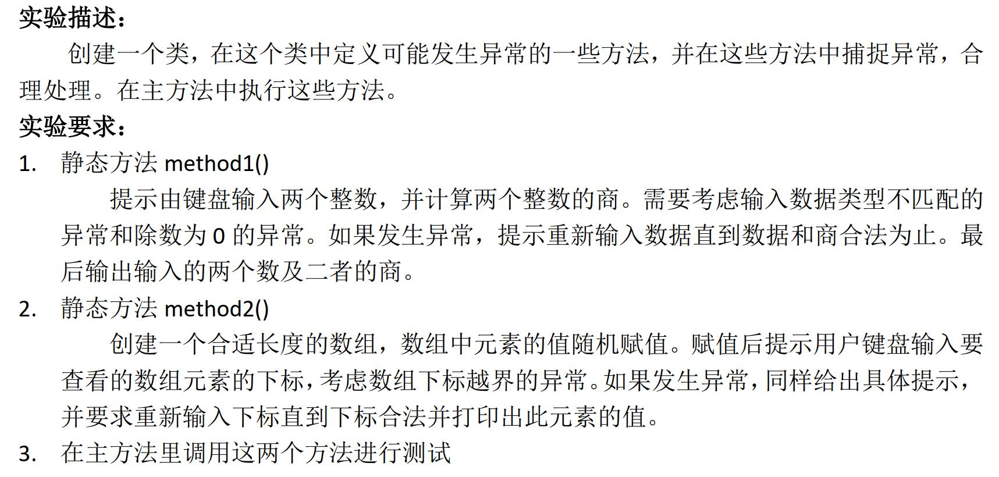
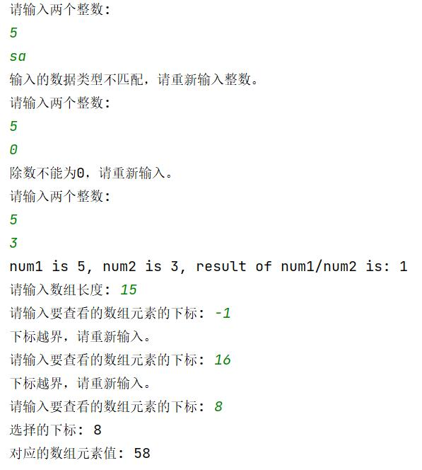
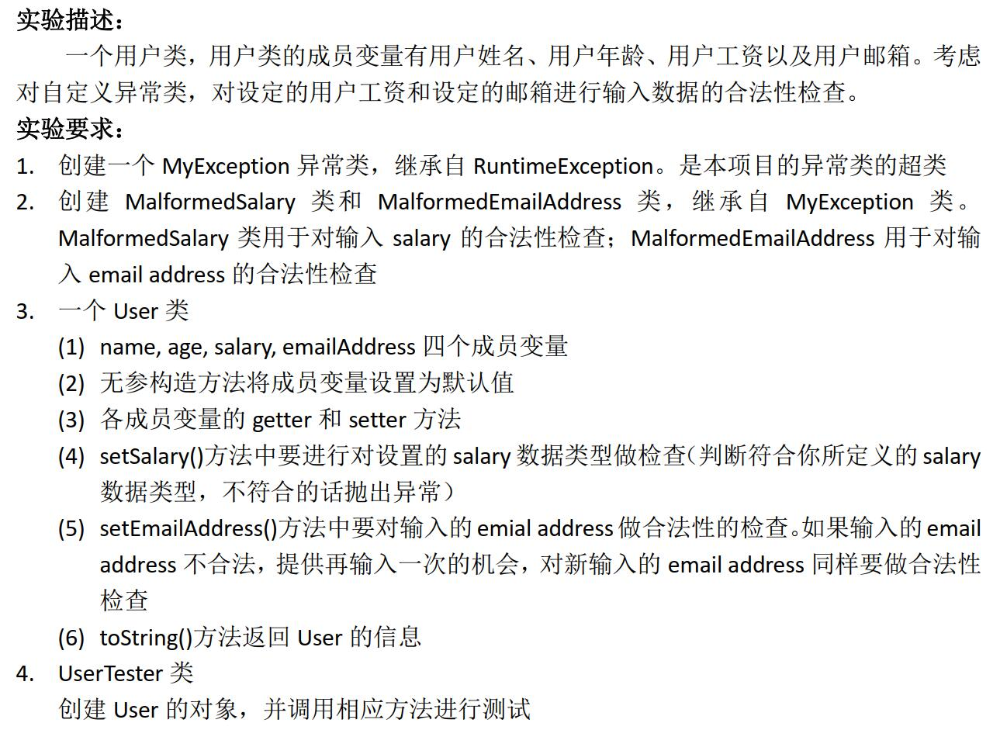
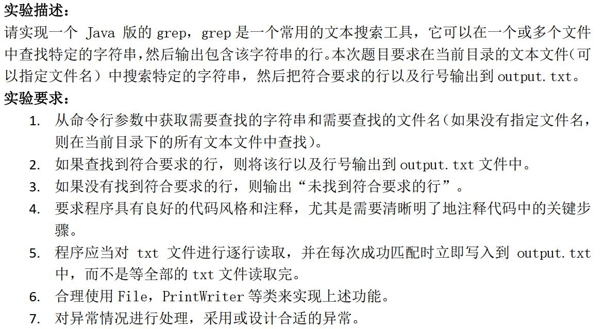
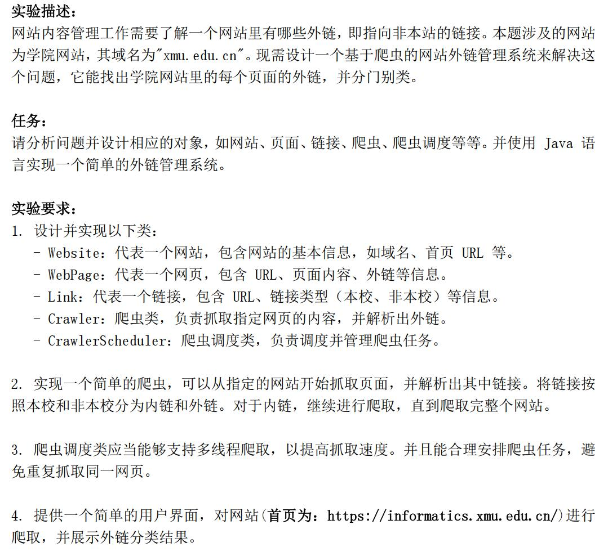
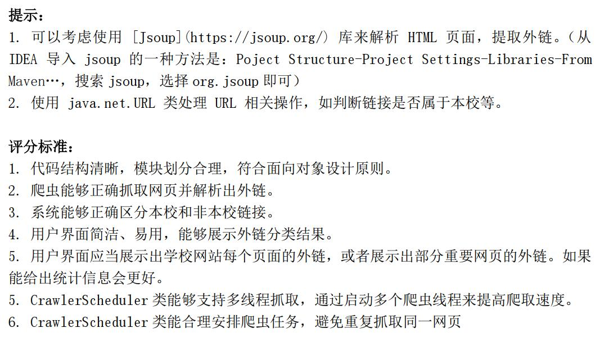
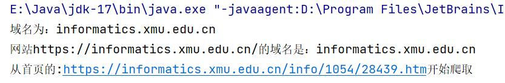
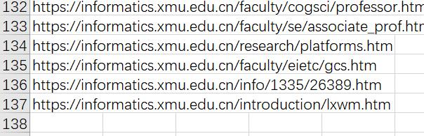
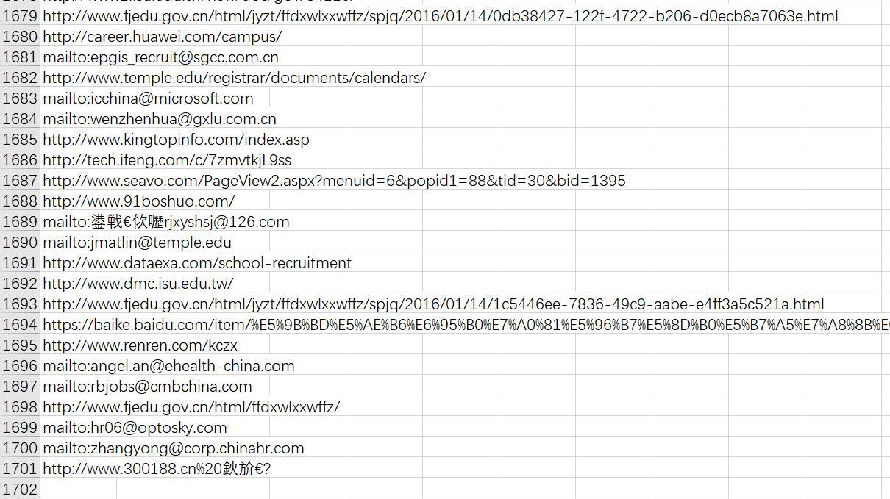

# 实验一：体验异常的捕捉



-----

## 实验过程

**核心代码展示：**

```java
//method1
public static void method1() {
        Scanner scanner = new Scanner(System.in);
        int num1=0, num2=0;
        int result = 0;
        boolean validInput = false;

        while (!validInput) {
            try {
                System.out.println("请输入两个整数:");
                num1 = scanner.nextInt();
                num2 = scanner.nextInt();

                result = num1 / num2;
                validInput = true;
            } catch (InputMismatchException e) {
                System.out.println("输入的数据类型不匹配，请重新输入整数。");
                scanner.nextLine(); // 清空输入缓冲区
            } catch (ArithmeticException e) {
                System.out.println("除数不能为0，请重新输入。");
                scanner.nextLine(); // 清空输入缓冲区
            }
        }
        System.out.print("num1 is "+num1);
        System.out.print(", num2 is "+num2);
        System.out.println(", result of num1/num2 is: "+result);
    }
```

```java
//method2
public static void method2() {
        Scanner scanner = new Scanner(System.in);

        System.out.print("请输入数组长度: ");
        int length = scanner.nextInt();
        int[] array = new int[length];

        // 随机赋值
        for (int i = 0; i < length; i++) {
            array[i] = (int) (Math.random() * 100);
        }

        int index = -1;
        boolean validIndex = false;

        while (!validIndex) {
            try {
                System.out.print("请输入要查看的数组元素的下标: ");
                index = scanner.nextInt();

                if (index < 0 || index >= length) {
                    System.out.println("下标越界，请重新输入。");
                } else {
                    validIndex = true;
                }
            } catch (InputMismatchException e) {
                System.out.println("输入的数据类型不匹配，请重新输入整数。");
                scanner.nextLine(); // 清空输入缓冲区
            }
        }
```

**涉及知识点：**

**try-catch语句：**

* 捕捉多个异常

```java

try {
    // 一些可能抛出异常的代码
    int[] arr = {1, 2, 3};
    System.out.println(arr[5]);
} catch (ArrayIndexOutOfBoundsException e) {
    // 处理ArrayIndexOutOfBoundsException异常
    System.out.println("数组索引越界！");
} catch (NullPointerException e) {
    // 处理NullPointerException异常
    System.out.println("空指针异常！");
}

```

* 使用finally语句：

```java
FileWriter writer = null;
try {
    // 一些可能抛出异常的代码
    writer = new FileWriter("file.txt");
    writer.write("Hello, world!");
} catch (IOException e) {
    // 处理IOException异常
    System.out.println("文件写入错误！");
} finally {
    // 无论是否发生异常，都会执行finally块中的代码
    try {
        if (writer != null) {
            writer.close();
        }
    } catch (IOException e) {
        // 处理关闭文件时可能发生的异常
        System.out.println("关闭文件错误！");
    }
}

```


## 实验结果



# 实验二：自定义异常




-----

## 实验过程

**核心代码：**

```java
//MalformSalary类
//对父类中的detailMessage方法重写
    public String detailMessage(){
        return "salary格式错误";
    }
	//使用Integer.parseInt判断是否合法
    public boolean judge(){
        int num=0;
            try {
                num = Integer.parseInt(salary);
                if (num < 0){
                    System.out.println(detailMessage());
                    return false;
                }
            } catch (NumberFormatException e) {
                System.out.println(detailMessage());
                return false;
            }
            return true;

    }
```

```java
//MalformedEmailAddress类
//对父类中的detailMessage方法重写
public String detailMessage(){
        return "EmailAdress格式不符合";
    }
//判断是否符合email格式
    public boolean judge(){
        String tag1="@qq.com";
        String tag2=" ";
        int index=emailAddress.indexOf(tag1);//必须含有tag1关键字
        boolean contains2=emailAddress.contains(tag2);
        //包含"@qq.com"且不包含空格
        if((index!=emailAddress.length()-tag1.length())||contains2){
            System.out.println(detailMessage());
            return false;
        }else{
            //"@qq.com"前只可有数字or字母
            for(int i=0;i<index;i++){
                    char c=emailAddress.charAt(i);
                    if(!(Character.isDigit(c)||Character.isLetter(c))){
                        System.out.println(detailMessage());
                        return false;
                    }
            }
        }
        return true;
    }
```


## 实验结果


# 实验三：Java版的grep



----

## 实验过程

**核心思路**

首先获取当前文件路径，将txt文件存入数组。遍历数组中的每个txt文件的每一行，判断是否含有所查找的字符串searchString，若有，将当前文件名称即searchString出现行数存入output.txt文件中

**核心代码**

```java
//遍历当前目录下所有的txt文件，并遍历所有txt文件，调用searchFile来完成具体操作
try {
            File[] files;
            if (fileName != null) {
                File file = new File(fileName);
                files = new File[]{file};
            } else {

                //创建currentDir来表示当前目录
                File currentDir = new File(".");
                //查看当前目录绝对路径的字符串表达
                System.out.println(currentDir.getAbsolutePath());
                //用ListFiles筛选出所有以".txt"结尾的文件，存入file数组
                files = currentDir.listFiles((dir, name) -> name.toLowerCase().endsWith(".txt"));

            }
            //若在文件夹中没有找到符合要求的行
            if (files == null || files.length == 0) {
                System.out.println("未找到符合要求的行");
                return;
            }
            //创建PrintWriter对象，用于向output文件输入
            PrintWriter writer = new PrintWriter("output.txt");
            for (File file : files) {
                searchFile(file, searchString, writer);
            }
            writer.close();

            System.out.println("搜索完成，结果已保存到output.txt");
        } catch (IOException e) {
            System.out.println("发生IO异常：" + e.getMessage());
        }
```

```java
//判断当前文件的所有行中是否含有searchString，若有，写入writer指代的文件中
private static void searchFile(File file, String searchString, PrintWriter writer) throws IOException {
        //当前行号
        int lineNumber = 0;
        try (BufferedReader reader = new BufferedReader(new FileReader(file))) {
            //每行文本
            String line;
            //直至文件末尾
            while ((line = reader.readLine()) != null) {
                lineNumber++;
                if (line.contains(searchString)) {
                    //每次匹配成功立即写入output.txt
                    writer.println("文件：" + file.getName() + "，行号：" + lineNumber + "，内容：" + line);
                }
            }
        }
    }
```

----

## 实验结果

1.txt

```
hello


omygod


test
```

2.txt

```


hello!


hi
```

output.txt

```
文件：1.txt，行号：1，内容：hello
文件：2.txt，行号：9，内容：hello!
```

# 实验四：网站外链管理系统





------

## 实验过程

* 区分本校和非本校

  ```java
              //获取<a>标签元素的"href"属性的值
              String href = link.attr("abs:href");
              //System.out.println(href);
              //若为内链
              if(href.startsWith(root)) {//root="https://informatics.xmu.edu.cn/"
                  //跳过下载的文件
                  if (!(href.contains(".doc") || href.contains(".xls") || href.contains(".pdf")||href.contains(".rar")))
                      //加入集合
                      internalLinks.add(href);
              }
              else {
                  //且不是校内网站
                  if(!href.contains("xmu"))
                      outernalLinks.add(href);
              }
  ```

  

* 展示外链分类结果(存入csv)

  ```java
              String csvFilePath2 = "outer.csv";
              try (FileWriter writer = new FileWriter(csvFilePath2)) {
                  for (String item : outernalLinks) {
                      writer.append(item);
                      writer.append("\n");
                  }
                  writer.flush();
                  System.out.println("outernalLinks has been written to the CSV file.");
              } catch (IOException e) {
                  e.printStackTrace();
              }
  ```

* 不重复爬取

  用flagLinks集合来保证，每次爬取前需确认链接不包含在flagLinks中，爬取后将其加入flagLinks

  ```java
              for (String element : internalLinks) {
                  if (!flagLinks.contains(element)) {
                      flagLinks.add(element);
                      System.out.println("从首页的:"+element+"开始爬取");
                      CrawlerScheduler.getNextURL("https://informatics.xmu.edu.cn/", element, flagLinks, outernalLinks);
                  }
              }
  ```

  

* 爬取https://informatics.xmu.edu.cn/的所有内链

  ```java
  public static void getNextURL(String root,String url,Set<String> flag,Set<String> outer){
  
          Crawler temp=new Crawler(root,url);
  
          if(temp.setDoc()) {
  
              Set<String> in = new HashSet<>();
              Set<String> out = new HashSet<>();
              temp.setLinks();
              in = temp.getInternalLinks();
              out = temp.getOuternalLinks();
              outer.addAll(out);
  
              Set<String> xorSet = new HashSet<>();
              xorSet.addAll(in);
              xorSet.removeAll(flag);
              for (String inter : in) {
                  //若未爬取过,且同双胞胎链接未被爬取过
                  if (!(flag.contains(inter)||flag.contains(inter.substring(0,inter.length()-1)))) {
                      flag.add(inter);
                      System.out.println(inter);
                      getNextURL(root, inter, flag, outer);
                  } else
                      continue;
              }
          }else
              return;
  
      }
  ```

* 获取网站域名

  ```java
  XMU.setDomain(bug.getDomain());//获取网站域名
              System.out.println("网站" + XMU.getLink().getUrl() + "的域名是：" + XMU.getDomain());
  ```

-----

## 实验结果

* 获取网站域名



* 获取所有https://informatics.xmu.edu.cn/的内链并存为inter.csv

  共获取了137条不含下载文件(rar、doc、xls、pdf)的、不含双胞胎链接的内链

  

* 获取所有https://informatics.xmu.edu.cn/的外链并存为outer.csv

  共获取了1701条不重复的外链

  

